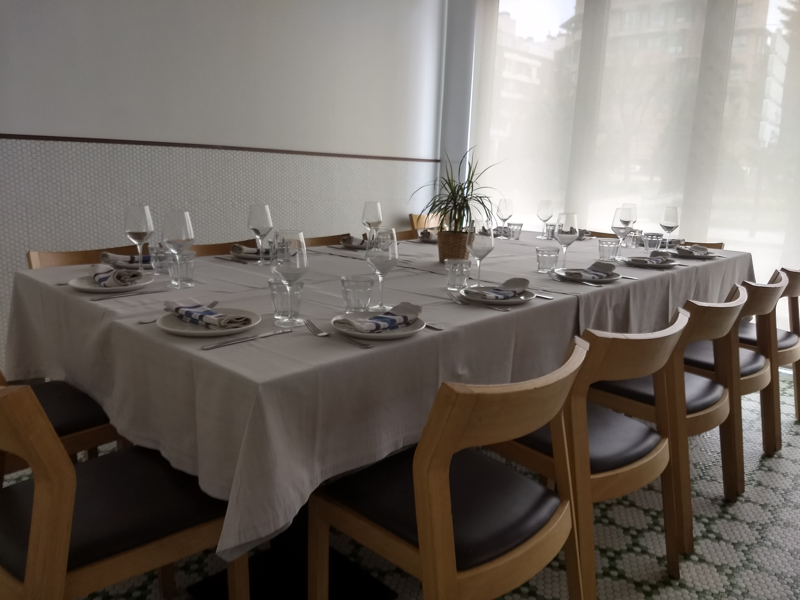

<script> 
    $(document).ready(function() { 
    $head = $('#header'); 
    $head.prepend('<A href = https://www.cuttingedge-events.com></A>') 
    }); 
</script> 


```{r echo=FALSE, message=FALSE,warning=FALSE}
library(readxl)
library(shiny)
library(dplyr)
library(knitr)
```


## **Option 1** - Hotel Pullman Madrid Airport and Feria

The **Aurea Meeting Room** in Hotel Pullman Madrid Airport and Feria is a meeting room with a fixed furniture. It has a big table up to 16 pax.
It has natural lighting.

    The Cost would be:
    Rental per day: 1200€ VAT inc
    AV rental (screen and projector) per day: 560€ VAT inc


<style>
p.comment {
background-color: #ffcc99;
padding: 10px;
border: 1px solid black;
border-radius: 5px;
}
</style>


<p class="comment">
**The hotel offers a Finger Tapas menu from 52€ VAT inc** *Including:8 tapas + fresh fruit , drinks and coffees*</p>  


****

## **Option 2** - Restaurant Orgaz

Restaurant Orgaz has a private room up to 16 pax. It is a nice restaurant located walking distance from the Fair.

    The Cost would be:
    Rental per hour: 150€ VAT inc (minimum 3 hours)
    AV rental (screen and projector) per day: 560€ VAT inc





<style>
p.comment {
background-color: #ffcc99;
padding: 10px;
border: 1px solid black;
border-radius: 5px;
}
</style>


<p class="comment">
**The Restaurant offers set menus from 47€ VAT inc** *Including:starters to share + main course+ dessert + drinks and coffees*</p>  


## Map

<iframe src="https://www.google.com/maps/d/embed?mid=17comrgQHDag3LxDYi4XuHbAVeHGprrsm&hl=es" width="800" height="500"></iframe>

  * Hotel Pullman Airport is located less than 5 minutes from IFEMA entrance
  * Restaurante Orgaz is located around 20 minuts walking from IFEMA entrance


****

## Terms & Conditions

  * Rates valid for 2019.
  
  * Cutting Edge Events management fee including in the detailed rates
  
  * VAT included. 
  
  * No reservation has been done. Availability upon request.
  
*****


